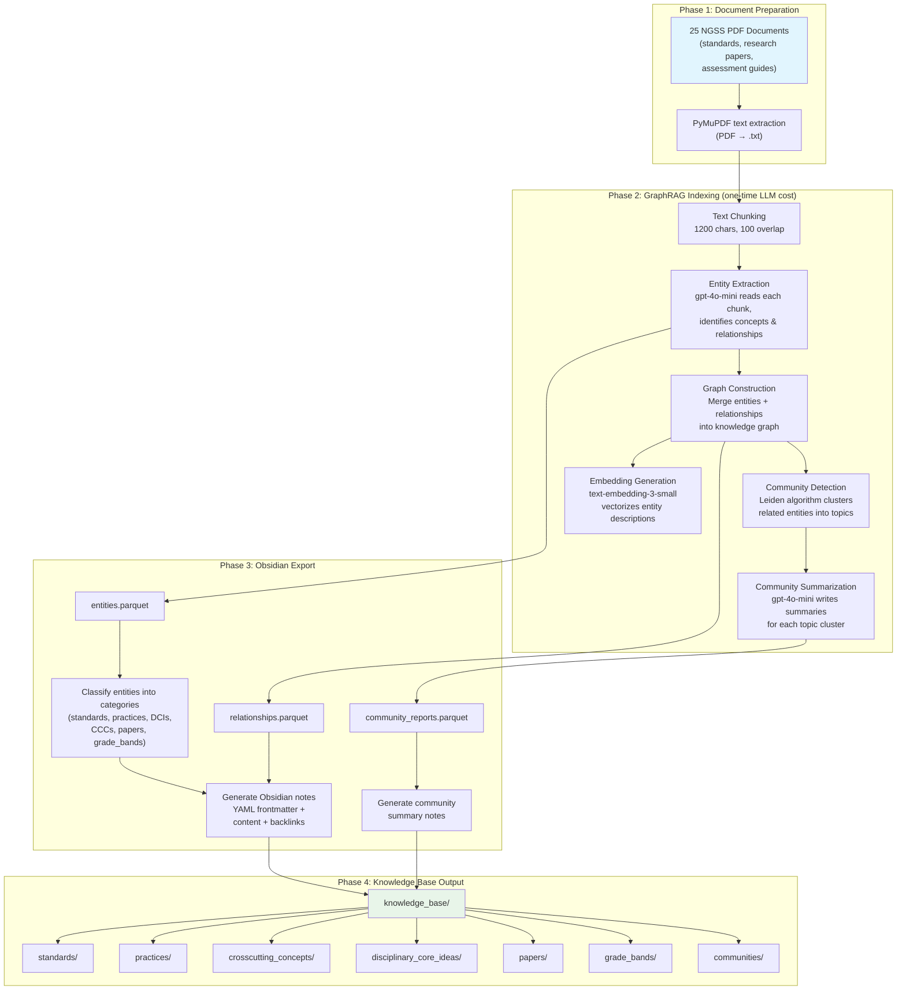
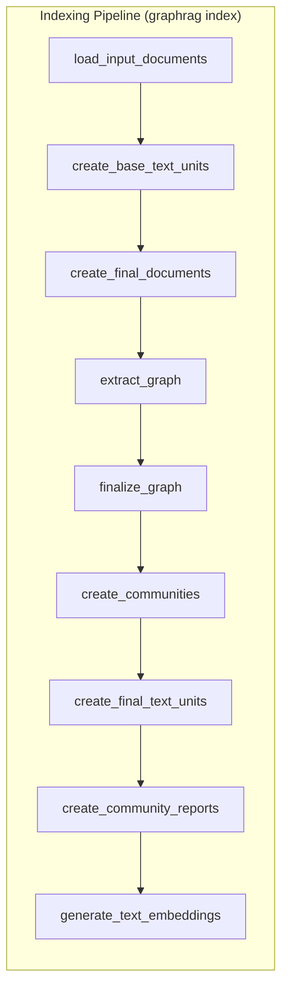
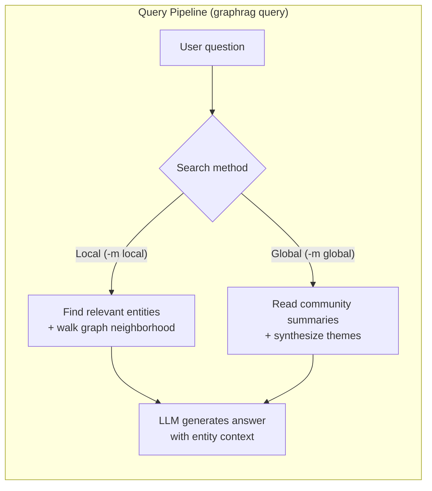
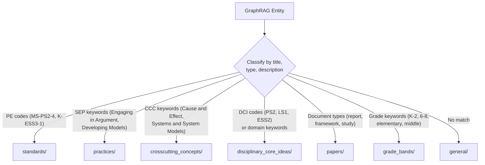
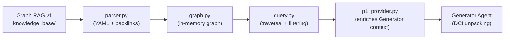

# Graph RAG v1 — NGSS Knowledge Base Extraction

Auto-generated Obsidian knowledge base from NGSS-related PDF documents using **Microsoft GraphRAG** for entity extraction and community detection.

## Method Overview



## Models Used

| Component | Model | Provider | Purpose |
|-----------|-------|----------|---------|
| Entity Extraction | `gpt-4o-mini` | Azure OpenAI | Reads text chunks, identifies entities (concepts, standards, people, organizations) and relationships between them |
| Community Summarization | `gpt-4o-mini` | Azure OpenAI | Writes thematic summaries for each cluster of related entities |
| Embeddings | `text-embedding-3-small` | Azure OpenAI | Generates vector representations of entity descriptions for similarity search |

**Azure OpenAI Resource**: `ngss-api` (endpoint: `https://ngss-api.openai.azure.com`)

## GraphRAG Configuration

| Setting | Value | Rationale |
|---------|-------|-----------|
| Chunk size | 1200 characters | Balance between granularity and cost |
| Chunk overlap | 100 characters | Prevents losing context at chunk boundaries |
| Max gleanings | 1 | Additional extraction passes per chunk |
| Community max cluster size | 10 | Keeps topic groups focused |
| Community report max length | 2000 tokens | Detailed but not overly long summaries |

## Pipeline Architecture





## Obsidian Note Format

Each generated note follows this structure for compatibility with the custom GraphRAG parser in `data_pipeline/graphrag/parser.py`:

```markdown
---
category: disciplinary_core_ideas
type: concept
source: graphrag_extraction
extracted_date: 2026-02-28
---

# PS2.B: Types of Interactions

## Description

Gravitational forces are always attractive and depend on
the masses of interacting objects...

## Related Concepts

- [[MS-PS2-4]] — Students construct arguments about gravitational interactions
- [[Engaging in Argument from Evidence]] — Primary SEP for this PE
- [[Systems and System Models]] — Related crosscutting concept
- [[How People Learn]] — Research on force misconceptions
```

The YAML frontmatter is parsed by the custom GraphRAG system to categorize nodes, and `[[backlinks]]` are extracted to build graph edges.

## Entity Classification

Entities extracted by GraphRAG are automatically classified into Obsidian categories using keyword matching:



## Source Documents

25 PDF documents from the NGSS research collection:

- NGSS framework and standards documents
- ELA/ELD standards and integration guides
- Learning science research (How People Learn, etc.)
- Assessment framework and design guides (SNAP, NAEP, NSTA)
- ELL support and language integration research
- Curriculum design toolkits

## Integration with DCI Unpacking Pipeline

The generated knowledge base plugs into the existing ADAPT AI pipeline:



To connect:
```bash
# Set environment variable
export KNOWLEDGE_BASE_PATH="/Users/freeman/Desktop/ED_PhD_Project/ED_Project/Graph RAG v1/knowledge_base"
```

Or uncomment the GraphRAG code in `data_pipeline/providers/p1_provider.py`.

## Notebooks

| Notebook | Location | Purpose |
|----------|----------|---------|
| `test_graphrag.ipynb` | `azure-backend/tests/` | PDF extraction, GraphRAG indexing, query testing |
| `extract_graphrag.ipynb` | `azure-backend/tests/` | Export parquet → Obsidian notes |

## Reproducibility

To regenerate the knowledge base from scratch:

1. Run `test_graphrag.ipynb` cells 1-6 (extract PDFs, configure Azure OpenAI, run indexing)
2. Run `extract_graphrag.ipynb` (export to Obsidian notes)
3. Open this folder as an Obsidian vault to browse and refine
